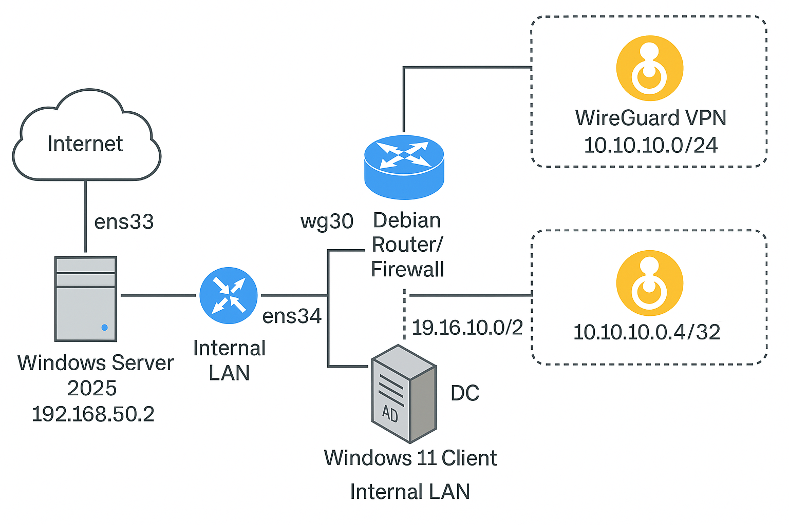
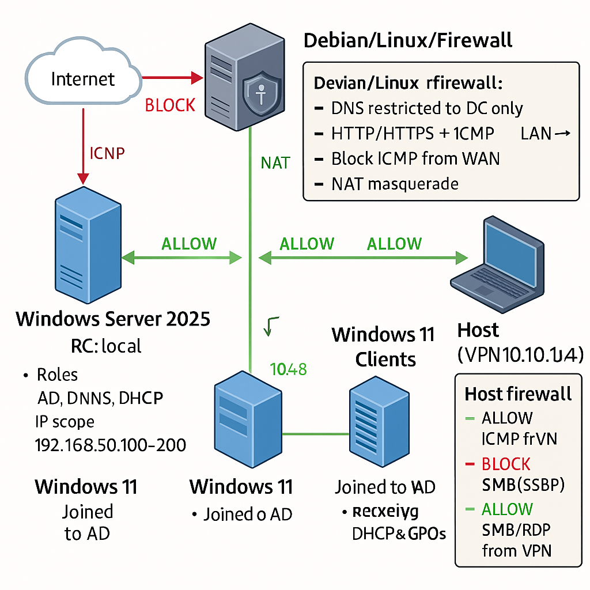

# 🏢 Corporate Lab Environment – Networking, AD, VPN & Security  

  
  
  

---

## 📖 Overview  
This repository documents a **hands-on corporate lab environment** built with:  
- 🐧 **Debian router/firewall** (`nftables`)  
- 🖥️ **Windows Server 2025 Domain Controller**  
- 💻 **Windows 11 clients**  
- 🔐 **WireGuard VPN**  

The goal is to demonstrate **real-world skills** in networking, security hardening, and hybrid Linux/Windows administration.  

---

## 📡 Network Topology  

Technical and visual diagrams are included for quick understanding.  

  
  

---

## 🔐 Defense in Depth  

### Layer 1 – Debian (nftables)  
- ICMP: allowed LAN↔LAN and VPN↔VPN; blocked from Internet to LAN.  
- DNS: only DC (192.168.50.2) is allowed to resolve to the Internet.  
- Web: LAN → Internet HTTP/HTTPS allowed.  
- NAT: masquerade for LAN and VPN out via `ens33`.  
- Admin: SSH and WireGuard (UDP 51820) allowed from trusted networks.  

### Layer 2 – Windows Host Firewall (VPN client 10.10.10.4)  
- Allow ICMP only from VPN 10.10.10.0/24; block elsewhere.  
- Allow SMB (445) and RDP (3389) from VPN only.  
- Optional: Allow SSH (22) from VPN if OpenSSH Server is enabled.  

---

## 🚀 Implementation Highlights  
- Debian Router with `ens33` (NAT), `ens34` (LAN 192.168.50.0/24), and `wg0` (VPN 10.10.10.0/24).  
- Windows Server 2025 (DC): AD DS, DNS, DHCP (scope 192.168.50.50–200), OUs, users, groups, GPOs.  
- Windows 11 clients joined to domain, receiving DHCP/GPOs.  
- WireGuard VPN peers for DC, Win11, and Host.  

---

## ✅ Skills Practiced  
- Networking (routing, NAT, DNS, DHCP)  
- nftables firewalling  
- AD administration (users, groups, GPOs)  
- WireGuard VPN setup  
- Linux/Windows integration  
- Security hardening  

---

## 📈 Real-World Impact  
The lab mirrors **enterprise setups** with:  
- Centralized identity (Active Directory)  
- Policy-driven security (GPOs, host firewalls)  
- Controlled VPN access for remote users  

---

## 📌 Future Improvements  
- Add monitoring (Zabbix/Prometheus)  
- Deploy SIEM (ELK/Splunk)  
- Expand VPN scenarios  
- Test Intune/MDM integration  
- Compare with a commercial firewall (Fortinet, Cisco ASA)  

---

## 📂 Repository Structure  

